# kaggle-camera
## Table Of Contents
* [Task](#task)
* [Dataset](#dataset)
* [Evaluation](#evaluation)
* [Summary of the Solution](#summary-of-the-solution-pytorch)
    - [preprocessing and training](#preprocessing-and-training-steps-are-mostly-in-chronological-order)
    - [prediction](#prediction)
    - [what didn't work, or didn't work as good](#what-didnt-work-or-didnt-work-as-good)
* [Results](#results)
* [Telegram bot](#telegram-bot)
* [Ideas for future work](#ideas-for-future-work)

## Task
The task was to identify the camera that the image was taken with.
<!-- * given dataset of photos taken from different cameras (iPhone, Galaxy Note, LG Nexus etc.) -->
<!-- * goal is to classify camera model -->
<!-- * random subset is preprocessed using \{JPG compression, gamma correction, resizing\} -->

## Dataset
* Images in the training set were captured with **10** different camera models, a single device per model, with **275** full images from each device.
* The list of camera models is as follows:
    - Sony NEX-7
    - Motorola Moto X
    - Motorola Nexus 6
    - Motorola DROID MAXX
    - LG Nexus 5x
    - Apple iPhone 6
    - Apple iPhone 4s
    - HTC One M7
    - Samsung Galaxy S4
    - Samsung Galaxy Note 3
* Images in the test set were captured with the same 10 camera models, but using a *second device*.
* While the train data includes full images, the test data contains only single *512 x 512* pixel blocks cropped from the center of a single image taken with the device.
* Half of the images in the test set have been altered. The image names indicate whether or not they were manipulated. The set of possible processing operations is as follows
    - JPEG compression with quality factor \in {70, 90}
    - resizing (via bicubic interpolation) by a factor of {0.5, 0.8, 1.5, 2.0}
    - gamma correction using *gamma* \in {0.8, 1.2}
* Random samples from the training set:

  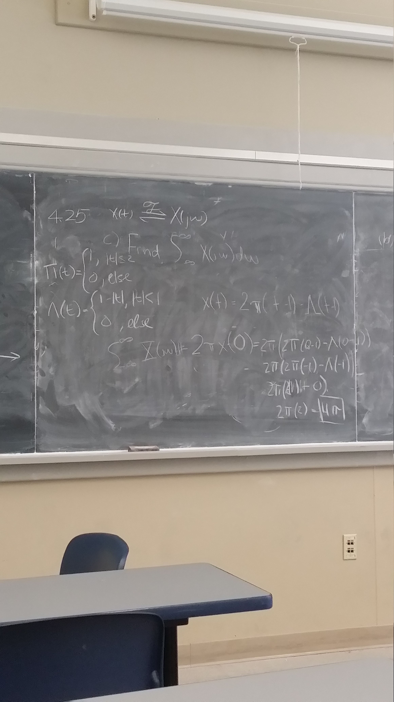
  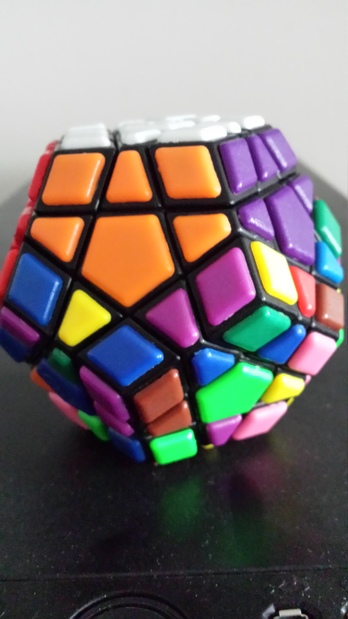
  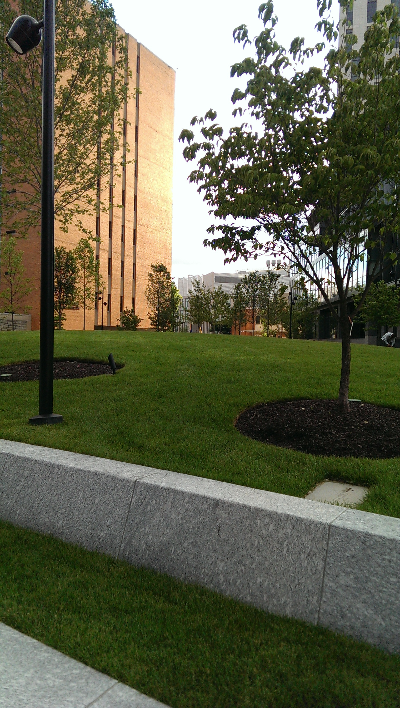
  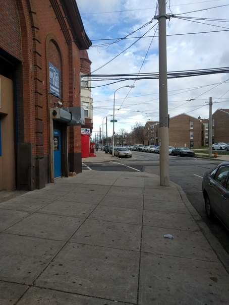
  
  
  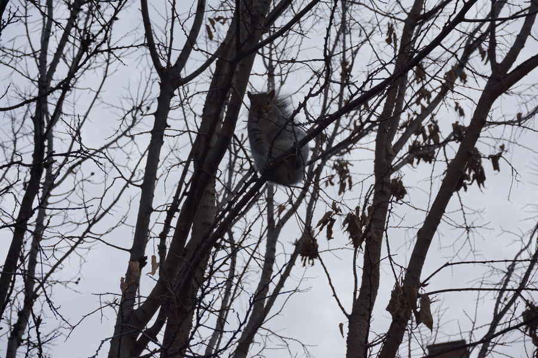
  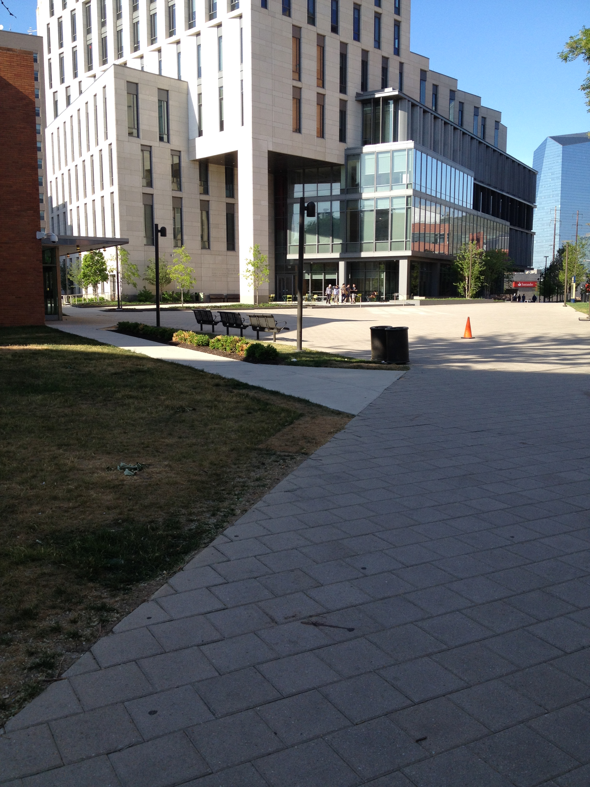
  

## Evaluation
Weighted accuracy, with weights *0.7* for unaltered images, and *0.3* for altered images.

## Summary of the Solution (PyTorch)

### preprocessing and training (steps are mostly in chronological order)
* fine-tune from CNNs trained on ImageNet, start from DenseNet-121, ResNet-{34, 50}
    - add 2-layer FC with `PReLU` activation
* on central crops 256x256 with rotations & mirroring, but then quickly switched to random ones with horizontal mirroring
* naturally, use the above augmentations (random JPG compression, resizing, or gamma correction), to make the model robust to those manipulations
* also random horizontal rotation
* losses:
    - standard categorical cross-entropy (logloss)
    - multi-class classification Hinge loss (`nn.MultiMarginLoss`)
    - `nn.MultiLabelSoftMarginLoss`
* optimization:
    - SGD+m worked better (converging to deeper minima) for these ResNet-like architectures, but also tried Adam
    - implement and use *Stratified* mini-batch variants of SGD (by class and eventually by `is_manip`)
    - use *early stopping*
    - implement and use `ReduceLROnPlateau`
* after a simple baseline using DenseNet-121 + ResNet-{34,50} and having **0.913** (public LB) is built, build a strong validation set:
    - use the least confident predictions on a training set
    - balance it: use the same fractions for examples of each class
    - also generate *pseudo-labels*: use the most confident predictions on a test set as "ground truth" and add them to the validation set (helps when there is some train/test data distribution mismatch, as in this case)
    <!-- * validation set: [TODO: insert image of the confusion matrix] -->
    - the resulting validation set correlated with public LB very well
* try larger architectures: DenseNet-201, ResNet-{101, 152}, ResNext-101({32, 64})
* add Dropout to the "head" (FC layer)
* implement and use *Cyclical LR* for faster transfer learning, [[arXiv]](https://arxiv.org/abs/1506.01186)
* use external data :P from Flickr and other resources (+ check metadata in extensions to find out the device) to construct a lot larger dataset, [[kaggle discussion]](https://www.kaggle.com/c/sp-society-camera-model-identification/discussion/47235), filter data in the [[notebook]](notebooks/andreas_data.ipynb)
* construct new strong, balanced validation set from least confident predictions ([notebook](notebooks/gen_balanced.ipynb))
* the new training dataset is imbalanced, so use:
    - *stratified undersampling*
    - *weighted loss function* (weights = `1/n_images_in_train__per_class`)
* add new pseudo-labels, all in stratified manner
* generate and save random crops in large blocks, for faster reading from HDD (+ other approaches like saving to `lmdb` database can be found in the [notebook](notebooks/gen_data.ipynb))
* add `--bootstrap` option for bagged runs
* the last day:
    - add new data (from `artgor`), generate new validation set and update pseudo-labels [[notebook]](notebooks/gen_balanced2.ipynb)
    - rot90 all patches during training
    - add `is_manip` flag to FC
    - :bangbang: implement and use *Distillation learning* [[arXiv]](https://arxiv.org/abs/1503.02531), to train some of the new models really fast by matching logits with strong models early in the training

### prediction
* test-time augmentation: 2/3 * `FiveCrop` (center and corners) + 1/3 * rot90, the idea is that almost nobody takes the photo upside down
* combine predictions of multiple models using arithmetic averaging of the logits
* "equalize" predictions using a simple greedy algorithm, as we know that each class has the same fraction in the private test set:
    - concluded after a couple of submissions with one class only, and getting exactly **0.1**
* final model:
    - 7 bagged DenseNet-121
    - various architectures trained using different initialization, hyperparameters, preprocessing, TTA, losses, optimizers, LR schedules, stages of training (checkpoints), etc. throughout the project (most of which are not as powerful as the best single one)

## what didn't work, or didn't work as good
* train models from scratch:
    - simple "toy" CNNs
    - AlexNet-like CNNs with wide receptive field
    - ResNet-like architectures (takes too long)
* other preprocessings:
    - special preprocessing, or special ordering of patches according to their complexity or informativity (a variant of "curriculum learning"), for more details please refer to [[paper]](http://home.deib.polimi.it/bestagini/_Papers/2017_EI_camera_model.pdf) and [[notebook]](notebooks/gen_info_patches.ipynb)
    - larger or smaller patches (e.g. 512x512, 384x384, 224x224, 128x128)
    - central 1024x1024 patches followed by random 256x256 crops
    - centeral crops only
    - apply convolution with 5x5 edge-detection kernel (`--kernel`) prior training
    - random "optical" crops (rotate patches such that the optical center is always in the same, predetermined corner)
    - align crops by two pixels (`--align`)
* other variants of test-time augmentation:
    - 16 random crops (no rotation)
    - JPG compression (some of the images are already compressed)
    - gamma correction {0.8, 1.0, 1.2}
    - `FiveCrop` (center and corners), no rotations
    - `FiveCrop` + rot90
    - `TenCrops` (center and corners + horizontally mirrored), no rotations
    - `TenCrops` + rotations
    - `TenCrops` + rot90 `TenCrops`
    - 2/3 * `TenCrops` + 1/3 * rot90 `TenCrops`
    - 2/5 * `TenCrops` + 1/5 * rot90 `TenCrops` + 1/5 * rot180 `TenCrops` + 1/5 * rot270 `TenCrops`
    - the whole D4 group of transformations
* other variants of combining predictions from multiple models:
    - arithmetic average of probabilities
    - geometric average of probabilities
    - median of probabilities
    - median of logits
    - weighted median of probabilities
    - weighted median of logits
    - arithmetic average of `sqrt(proba)`
    - arithmetic average of `proba ** 2`
    - arithmetic average of `softmax(logits * C)`, `C \in {0.5, 2.0}`
    - arithmetic average of `g(logits)`, where `g(x) = sqrt(|x|) * sign(x)`
    - arithmetic average of `softmax(g(logits))`, where `g(x) = sqrt(|x|) * sign(x)`
    - stacking (blending): train Logistic regression or SVM on their logits or probabilities

## Results
* best single model: **0.970** (public LB)
* final solution (ensemble of 33 models): **0.979** (private LB)
    - best private LB was **0.981** (:arrow_right: 14th place)
    - top1 solution: *0.989*, using 350GB of data and 20 GPUs :scream:
* placed **17/581** :tada:

  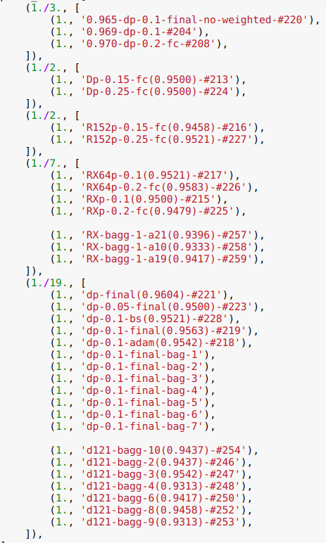
  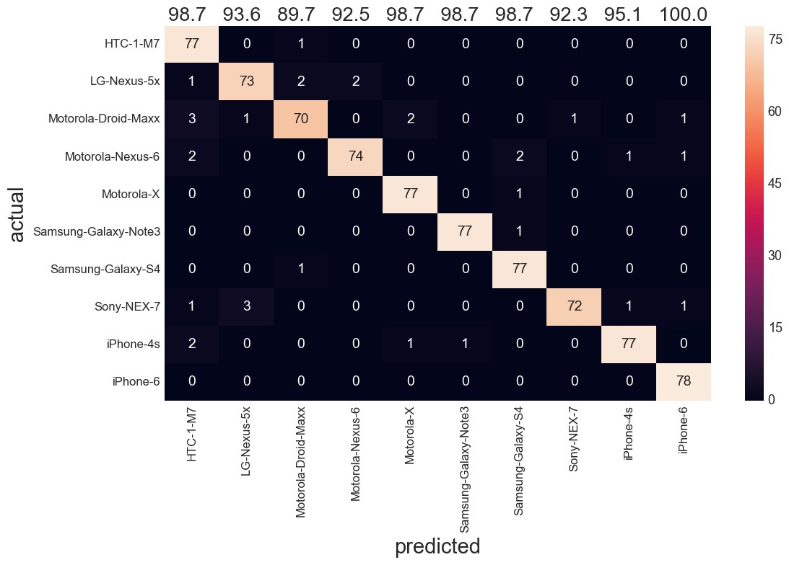
  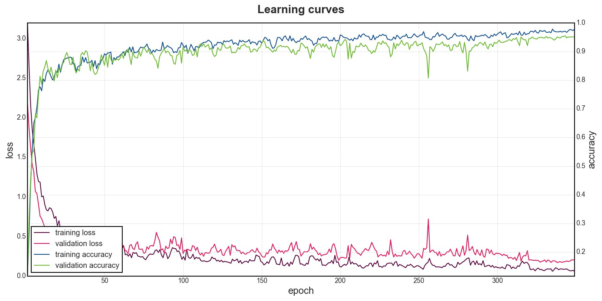

## Telegram bot
To get the most out of my limited resources, I have implemented a Telegram bot, that can quickly:
* display current checkpoints
* plot learning curves
* plot confusion matrices

  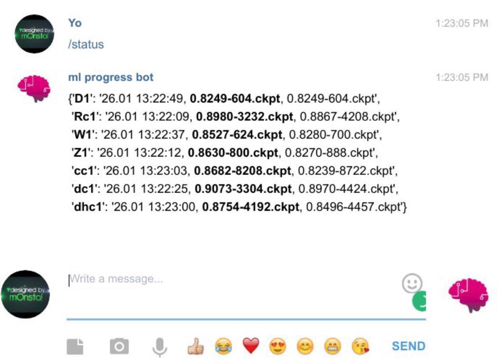
  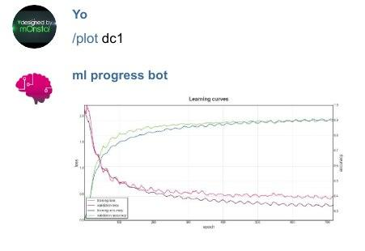
  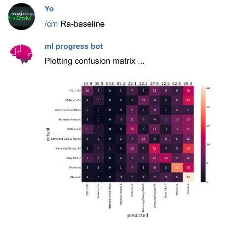

## Ideas for future work
* stratified split not only by a class (and `is_manip`) but also by a scene
* try freeze for the first epoch (only FC), then "release" with small learning rate
* try *Mixup*: [[arXiv]](https://arxiv.org/abs/1710.09412)
* use *Snapshot ensembles* for CNNs trained with Cyclir LR: [[arXiv]](https://arxiv.org/abs/1704.00109)
    - or simply average out top-K best checkpoints (similar if learning curves oscillate)
* play around with low-level features from CNNs (e.g. train k-NN on top of those)
* incorporate FFT-based features (on, e.g. `image - smooth(image)`)
* stack with `xgboost` :muscle:
* more advanced equalization methods:
    - [Hungarian algorithm](https://docs.scipy.org/doc/scipy-0.18.1/reference/generated/scipy.optimize.linear_sum_assignment.html)
    - force uniform distribution on a test set predictions in an information-theoretic sense (maximize differential entropy)
* try `np.memmap` in case of large datasets on HDD
